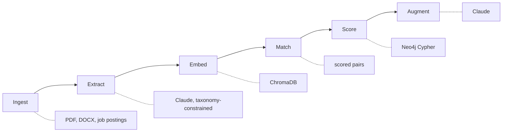

# CurricuAlign AI

**TETRA030** | TetraTHON 2026, Track D (EdTech) | Problem Statement 1: Dynamic Syllabus and Industry Skill-Gap Synchronizer

Higher education curricula lag three to five years behind market demand. Institutions have no automated way to audit a syllabus against live job market data, so graduates earn top grades while carrying severe skill gaps.

CurricuAlign AI ingests real syllabi and real job postings, maps both onto a shared skill ontology in Neo4j, quantifies the gap with evidence, and generates targeted syllabus modifications a professor can adopt without redesigning a course.

---

## The core idea

Most curriculum-audit tools do keyword matching: your syllabus says "Python", the job says "Python", tick the box. That finds nothing interesting.

The hard question is different. A syllabus teaching *relational database design* is missing *vector databases* and *RAG pipelines* — but saying so is only useful if you also know what it would cost to add them. That requires reasoning over relationships, not string comparison.

This is why the skill ontology is a graph. Given a course, the system answers:

> Which skills does the market demand, that this course does not teach, that sit within two hops of what it already teaches?

The two-hop constraint is what makes the output actionable. Adding a skill whose prerequisites are already satisfied is cheap. Adding one that needs three missing prerequisites first is a different conversation entirely.

**Worked example, from the live graph.** Teaching Retrieval Augmented Generation transitively requires:

| Hops | Prerequisite |
|---|---|
| 1 | Large Language Models, Vector Databases |
| 2 | Databases, Embeddings, Transformers |
| 3 | Data Structures, Deep Learning |
| 4 | Machine Learning, Optimization, Programming Fundamentals |

The system derives that chain automatically. A recommendation becomes "you cannot teach RAG until this dependency chain is covered, in this order" rather than "you are missing RAG".

---

## Architecture

Six stages, each with one responsibility and a stable interface, so any stage can be replaced without touching its neighbours.



| Stage | Input | Output | Implementation |
|---|---|---|---|
| Ingest | PDF/DOCX syllabi, job postings | Normalized `Document` | pdfplumber, python-docx |
| Extract | Raw document text | `SkillMention`, taxonomy-linked | Claude, structured output |
| Embed | Mentions and canonical skills | Vectors | sentence-transformers, ChromaDB |
| Match | Vectors | Scored `(mention, skill)` pairs | Chroma similarity |
| Score | Graph state | `GapReport` with severity | Cypher plus scoring module |
| Augment | GapReport plus course subgraph | Syllabus modifications | Claude |

**The Match-to-Score seam is deliberate.** Match emits nothing but a list of scored pairs. If vector retrieval underperforms, it can be swapped for fuzzy taxonomy matching with no downstream change. The interface is the insurance policy.

### Stack

| Component | Choice | Why |
|---|---|---|
| Skill ontology | Neo4j 5.26 | Multi-hop prerequisite reasoning; painful in SQL |
| Vector search | ChromaDB (embedded) | Semantic skill matching, no extra service to run |
| LLM | Claude API | Extraction and generation, with structured output |
| Backend | FastAPI, Python 3.11 | Native to the AI stack |
| Frontend | Next.js, TypeScript | Types generated from the OpenAPI schema |

---

## What works today

Verified against a live Neo4j instance, not asserted:

- **Skill taxonomy**: 438 canonical skills, 1474 aliases, 587 prerequisite edges across AI, data, web, systems, cloud, security, and engineering
- **Alias collapsing**: `ML`, `machine-learning`, and `Machine Learning` resolve to one node. `prompt injection` resolves to `LLM Security`, `xgboost` to `Ensemble Methods`, `k8s` to `Kubernetes`
- **Graph loaded**: 438 skills and 587 prerequisite edges live in Neo4j, with multi-hop traversal working
- **Semantic search**: all 438 skills embedded locally via sentence-transformers into ChromaDB. Phrases with zero keyword overlap resolve correctly: "orchestrating containers" returns Kubernetes (0.776), "training neural networks" returns Deep Learning (0.745), "storing numbers that represent meaning for similarity lookup" returns Vector Databases
- **Calibrated matching threshold**: measured, not guessed. See below
- **Gap scoring**: four-signal score with a tested health metric
- **Claude client**: content-addressed disk cache with a full fallback chain
- **66 tests passing**, including 6 integration tests against live Neo4j

### Design decisions worth defending

**The taxonomy is a hard constraint, not a suggestion.** Skill extraction links to a curated canonical list and may not invent nodes. Without this, `ML` and `Machine Learning` become separate skills and every gap number downstream is meaningless. Ambiguous aliases fail at load time rather than silently resolving to whichever skill loaded last.

**Every Claude call is cached by content hash.** The chain is cache, then live call, then a caller-supplied fallback. An expired key or a rate limit degrades output rather than breaking the page.

**The health score was wrong once, and a test caught it.** The first implementation used a normalized weighted mean. Adding twenty trivial gaps to one critical gap raised health from 5 to 73 — making a curriculum worse made it look better. Replaced with an unnormalized rank-decay penalty so additional gaps can only lower the score. This is exactly the class of bug that survives a demo unnoticed, because a wrong number looks entirely plausible on screen.

**The matching threshold is measured, not guessed.** The similarity floor started at 0.35, chosen during planning. Measured against the real 438-skill index:

| Band | Range |
|---|---|
| Genuine skill phrases | 0.643 - 0.776 |
| Unrelated syllabus prose | 0.554 - 0.619 |

At 0.35, ordinary administrative text passed as real skill mentions — "the cafeteria serves lunch at noon" matched Service Mesh at 0.565, and "office hours are held on tuesday afternoons" matched Cron Scheduling at 0.619. Each would have entered a gap report as a phantom skill with fabricated evidence.

The floor is now 0.63, inside the 0.024 separation gap, and `scripts/calibrate_threshold.py` reproduces the measurement. The script warns if the bands overlap, since that would mean no threshold separates signal from noise and the embedding model needs replacing.

**Where semantic matching genuinely fails.** Embeddings do not encode negation: "finding patterns in data without labelled examples" retrieves Supervised Learning rather than Unsupervised Learning. This is why exact taxonomy resolution runs first and vector hits are treated as probabilistic, never overriding a known-correct alias match.

---

## Running it

```bash
cp .env.example .env          # add your ANTHROPIC_API_KEY
docker compose up -d          # starts Neo4j and the backend
```

Load the taxonomy into the graph:

```bash
docker compose exec backend python -c "
from app.db.schema import apply_constraints, load_taxonomy, graph_counts
from app.taxonomy.loader import TaxonomyIndex
apply_constraints()
print(load_taxonomy(TaxonomyIndex.from_disk()))
print(graph_counts())
"
```

Run the tests:

```bash
docker compose exec backend pytest tests/ -v
```

Neo4j Browser is at `http://localhost:7474` (neo4j / curricualign). Try:

```cypher
MATCH path = (p:Skill)-[:PREREQUISITE_OF*1..3]->(t:Skill {canonical_name: 'Retrieval Augmented Generation'})
RETURN path
```

---

## In progress

- Skill extraction from real syllabi and job postings via Claude
- Gap reports served over the API
- Frontend: dashboard, course detail, graph explorer, augmenter diff

## Planned, off the critical path

Both have deterministic fallbacks, so neither can break the demo:

- **Fine-tuned skill embeddings.** Contrastive tuning on alias pairs, with before/after retrieval accuracy reported. Falls back to the base model via one config change.
- **Trend forecasting.** Regression over job-posting time series: "Kubernetes demand up 40 percent in six months, curriculum coverage zero". Falls back to a null slope, which the scoring math already treats as zero.

---

## Repository

- `docs/superpowers/specs/` - design specification
- `docs/superpowers/plans/` - implementation plan
- `backend/app/taxonomy/` - canonical skill taxonomy and resolver
- `backend/app/pipeline/` - the six pipeline stages
- `backend/app/db/` - Neo4j schema and queries
- `backend/tests/` - 55 tests
