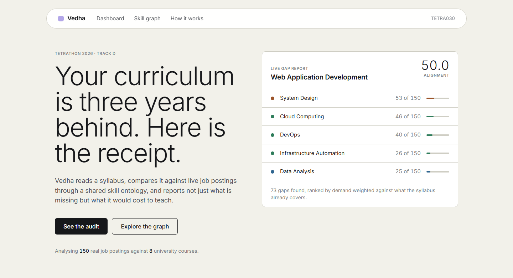
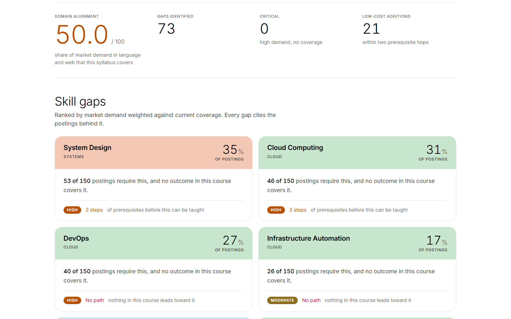
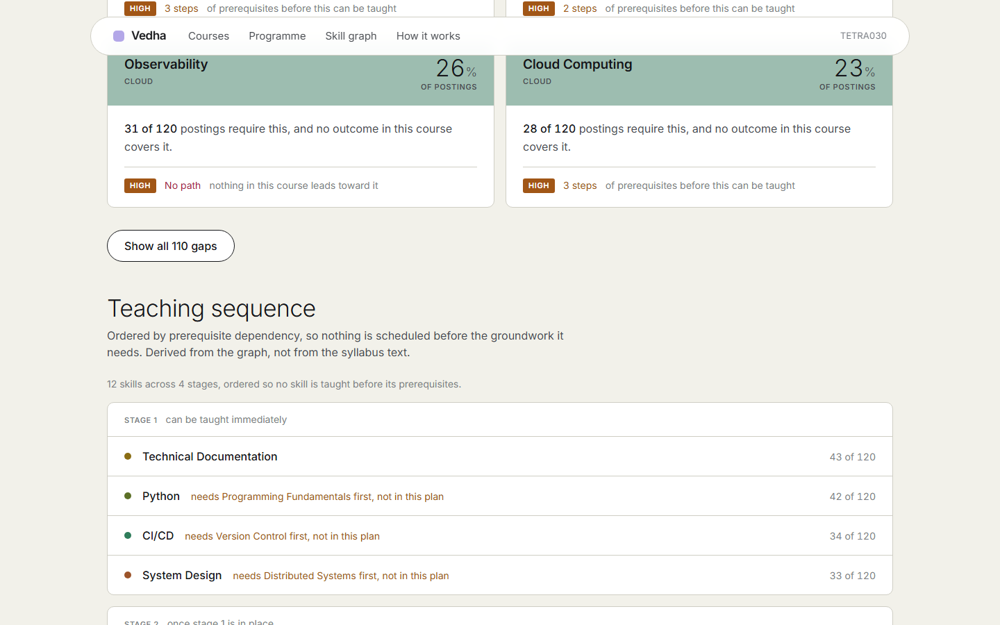
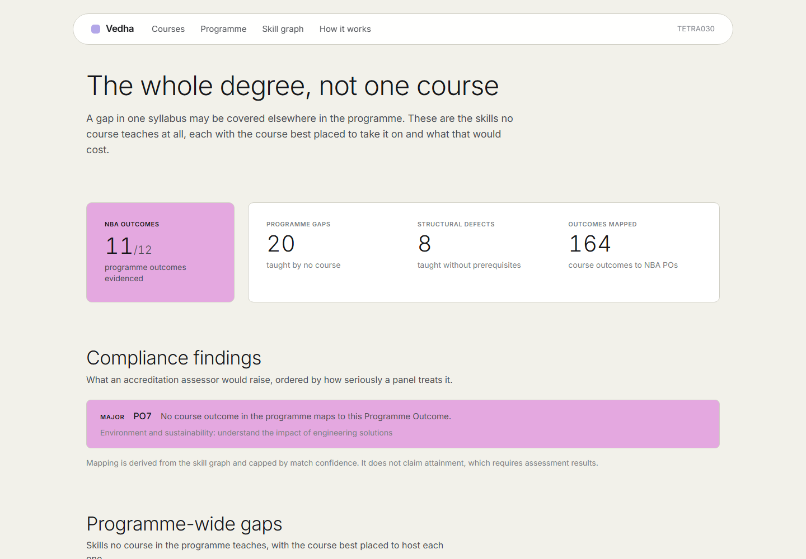
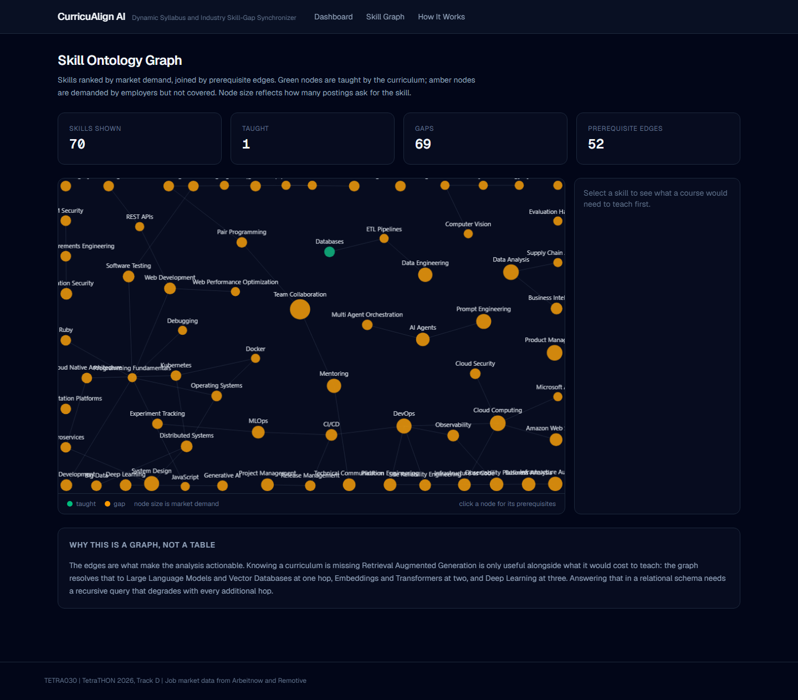
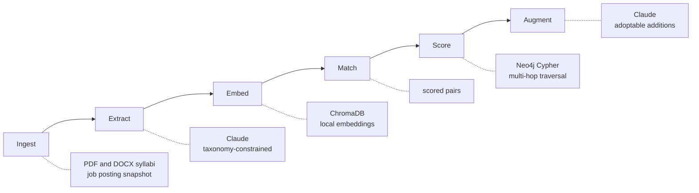
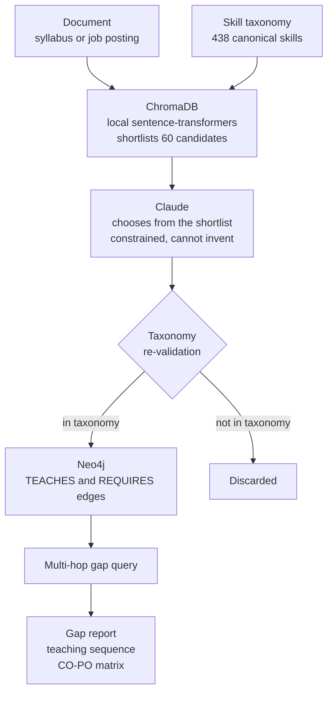
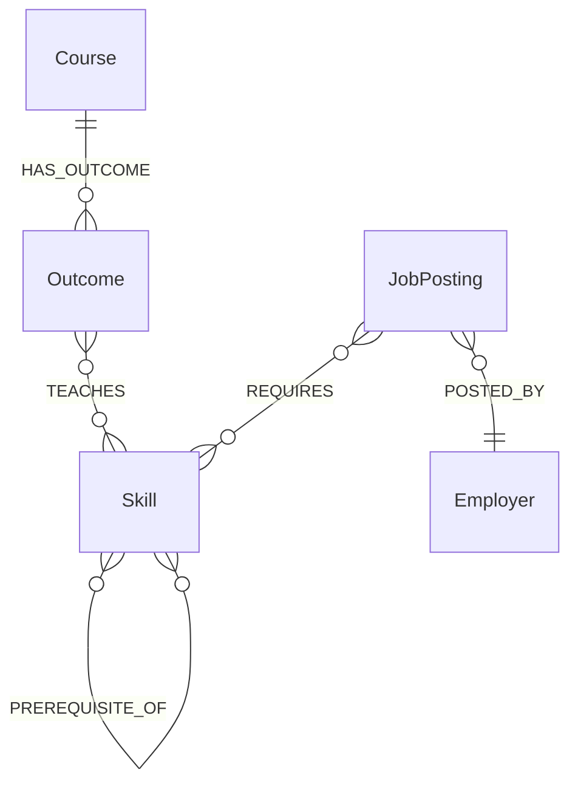

# Vedha

**TETRA030** | TetraTHON 2026, Track D (EdTech) | Problem Statement 1: Dynamic Syllabus and Industry Skill-Gap Synchronizer

*Vedha* means to pierce through. That is what the prerequisite chain does to a curriculum: it cuts past the surface question of what a syllabus is missing to the one that matters, which is what it would cost to teach.

Higher education curricula lag three to five years behind market demand. Institutions have no automated way to audit a syllabus against live job market data, so graduates earn top grades while carrying severe skill gaps.



*The panel on the right is a live API call, not an image. Those are real posting counts against a real syllabus.*

---

## What makes this different

**Most tools tell you what is missing. This one tells you what it costs to fix.**

A keyword diff reports that a syllabus lacks Retrieval Augmented Generation. That is a complaint, not a plan. Because the ontology records which skills are prerequisites for which, this system answers the harder question:

| Hops | Prerequisite for RAG |
|---|---|
| 1 | Large Language Models, Vector Databases |
| 2 | Databases, Embeddings, Transformers |
| 3 | Data Structures, Deep Learning |
| 4 | Machine Learning, Optimization, Programming Fundamentals |

A recommendation becomes *"you cannot teach RAG until this chain is covered, in this order"* rather than *"you are missing RAG"*. Adding Kubernetes to a course already teaching Docker is one hop and cheap; adding RAG to a course covering none of its prerequisites is a different conversation.

That is also the answer to **why a graph database**: it is a variable-length path search, which a relational schema answers only with a recursive query that degrades with every hop.

### Every number in this repository is real

No mock data, no seeded fixtures, no hardcoded fallback skill lists.

| | Source |
|---|---|
| 120 job postings analysed | Fetched from Arbeitnow and Remotive, committed as a snapshot |
| 42 course syllabi | Real documents from four institutions |
| 438 skills, 1474 aliases | Hand-curated taxonomy, every alias collision rejected at load time |
| Every gap and score | Computed from the graph at request time |

---

## Four institutions, three disciplines

The corpus spans computing, civil, and electronics engineering, which demonstrates the tool is not specific to one degree or even one field.

| Institution | Programme | Courses |
|---|---|---|
| MSU Baroda | BCA | 8 |
| NIT Tiruchirappalli | B.Tech Civil Engineering | 27 |
| NIT Tiruchirappalli | B.Tech Electronics and Communication | 2 |
| NIT Tiruchirappalli | B.Tech Instrumentation and Control | 3 |
| PDPU | B.Tech Computer Engineering | 2 |

Course code formats differ by institution, so the splitter detects the pattern per document rather than assuming one.

---

## What it does

### 1. Course gap report

Every gap cites real posting counts and its distance from what the course already teaches.



### 2. Teaching sequence

A ranked gap list says what is missing. It does not say what to do on Monday, because some gaps cannot be taught until others are in place. Ranking by demand alone would schedule Amazon Web Services before Cloud Computing.



The stages come from a topological layering of the prerequisite graph. Nothing in that ordering is hardcoded.

### 3. Programme-level analysis

A gap in one syllabus may be covered elsewhere in the degree. These are the skills **no course teaches at all**, each with the course best placed to host it and what that would cost.



It also finds **structural defects**: skills the curriculum teaches whose prerequisites nothing covers. On the real corpus this finds CSS taught without HTML, and Angular taught without TypeScript. Those are curriculum defects rather than market gaps.

### 4. NBA accreditation documentation

Indian engineering programmes are accredited against twelve Programme Outcomes fixed by the National Board of Accreditation. Every course must map its Course Outcomes to those POs with a correlation level, and departments assemble that matrix by hand across dozens of courses.

**Run against this corpus it maps 164 course outcomes and finds a genuine major non-conformity: no course across all 42 evidences PO7, environment and sustainability.**

Correlation strength is capped by match confidence. A skill matched at 0.5 cannot claim a substantial correlation, and matches below the confidence floor produce no claim at all. An inflated matrix is worse than a sparse one: an assessor who finds a single unsupported cell distrusts every other one.

It deliberately does **not** claim attainment, which requires assessment results from a university examination system.

### 5. Skill ontology graph

Node colour is the skill category. A dark ring marks a skill the curriculum already teaches. Node size is market demand. Clicking a node returns its prerequisite chain.



### 6. Syllabus augmenter

Claude proposes modifications a professor can adopt without redesigning the course: new outcomes, case studies, tools mapped to existing units, and project briefs. Prerequisite distance is passed to the model, so it does not propose advanced topics as though a course could absorb them directly.

---

## Architecture

### Pipeline

Six stages, each with one responsibility and a stable interface, so any stage can be replaced without touching its neighbours.



### How the AI components fit together

The two mandated AI components are not independent. ChromaDB narrows the problem before Claude sees it, which is what makes extraction affordable, and the taxonomy has the final say over both.



**Why the shortlist matters.** Sending all 438 canonical names in every prompt would be roughly 1.8M tokens across the corpus. Shortlisting first cuts prompt size by about ninety percent, and the re-validation step means a model that ignores the allowed list still cannot put an unknown skill into the graph.

### Graph schema



`TEACHES` carries a confidence, `REQUIRES` carries an importance, and `PREREQUISITE_OF` is the edge that makes everything else possible. Without it the system can only detect gaps; with it, it can sequence them.

### Stages

| Stage | Input | Output | Implementation |
|---|---|---|---|
| Ingest | PDF/DOCX syllabi, job postings | Normalized `Document` | pdfplumber, python-docx |
| Extract | Raw document text | `SkillMention`, taxonomy-linked | Claude, structured output |
| Embed | Canonical skills | Vectors | sentence-transformers, ChromaDB |
| Match | Mentions and vectors | Scored `(mention, skill)` pairs | exact alias, then similarity |
| Score | Graph state | `GapReport` with severity | Cypher plus scoring module |
| Augment | GapReport and course subgraph | Syllabus modifications | Claude |

**The Match stage is a deliberate seam.** It emits nothing but scored pairs, so if vector retrieval underperforms it can be swapped for fuzzy taxonomy matching with no downstream change. `ExactMatcher` already ships as that fallback.

### The three mandated components

| Requirement | Implementation |
|---|---|
| Skill Ontology Graph (Neo4j) | 438 skills, 1474 aliases, 587 prerequisite edges |
| Semantic Gap Analyzer (ChromaDB) | All skills embedded locally, no paid embedding API |
| Syllabus Augmenter (LLM) | Claude, constrained to additions that extend existing units |

### Stack

FastAPI and Python 3.11, Next.js and TypeScript, Neo4j 5.26, ChromaDB in embedded mode, Claude API, Docker Compose. Frontend types are generated from the OpenAPI schema, so the two halves cannot drift.

---

## Running it

```bash
cp .env.example .env          # add your ANTHROPIC_API_KEY
docker compose up -d          # Neo4j and the backend
docker compose exec backend python -m app.seed
```

Frontend:

```bash
cd frontend
npm install
npm run dev
```

- Landing page: `http://localhost:3000`
- Course audit: `http://localhost:3000/dashboard`
- Programme and accreditation: `http://localhost:3000/programme`
- Skill graph: `http://localhost:3000/graph`
- API documentation: `http://localhost:8000/docs`
- Neo4j Browser: `http://localhost:7474` (neo4j / curricualign)

Try the query that justifies the graph:

```cypher
MATCH path = (p:Skill)-[:PREREQUISITE_OF*1..4]->(t:Skill {canonical_name: 'Retrieval Augmented Generation'})
RETURN path
```

Tests:

```bash
docker compose exec backend pytest tests/ -v
```

---

## API

| Method | Path | Purpose |
|---|---|---|
| GET | `/api/courses` | Courses with alignment scores |
| GET | `/api/courses/{code}/gaps` | Ranked gap report with evidence |
| GET | `/api/courses/{code}/roadmap` | Teaching sequence by prerequisite order |
| POST | `/api/augment/{code}` | Claude-generated syllabus modifications |
| GET | `/api/programme` | Programme-wide gaps with placement |
| GET | `/api/programme/defects` | Skills taught without prerequisites |
| GET | `/api/programme/placement/{skill}` | Which course should teach a skill |
| POST | `/api/programme/audit` | Record a market snapshot, report drift |
| GET | `/api/accreditation/matrix` | CO-PO correlation matrix |
| GET | `/api/accreditation/findings` | Compliance findings by severity |
| GET | `/api/graph` | Skill graph nodes and edges |
| GET | `/api/market/trends` | Demand over time |
| POST | `/api/syllabi` | Upload a syllabus |

---

## Engineering decisions worth defending

**The taxonomy is a hard constraint, not a suggestion.** Skill extraction links to a curated canonical list and cannot invent nodes. Without this, `ML` and `Machine Learning` become separate skills and every downstream number is meaningless. Ambiguous aliases fail at load time rather than resolving to whichever skill loaded last; that gate rejected three real collisions during the build.

**Every Claude call is cached by content hash.** Verified: with the API key blanked entirely, a previously seen posting still returned all 15 extracted skills in 0.17 seconds. An expired key during evaluation degrades to instant cached results rather than a broken page.

**Courses are scored against their own subject area.** One course covers three to twelve percent of total tech demand, which is normal. Presenting that as a score out of 100 would imply a failing grade for every course ever written, so the denominator is demand within the course's own field and every report names what it was scored against.

**Soft skills are down-weighted, not censored.** Ranking by raw posting frequency put Team Collaboration and Mentoring above every technical gap. Both are genuine market signal, but "add teamwork to your database course" is not advice a curriculum committee can act on.

**Colour carries information.** Each skill category owns a block colour, so a gap card, a category tag, and a graph node all agree on what "cloud" or "data" looks like. The design system is documented in `frontend/DESIGN.md`.

---

## Bugs the tests caught

Each produced a plausible-looking wrong number that would have survived a demo unnoticed.

**The health score ran backwards.** Adding twenty trivial gaps to one critical gap raised the score from 5 to 73 — making a curriculum worse made it look better. A normalized weighted mean was letting a long tail dilute the average.

**The similarity threshold accepted noise.** The floor was 0.35, guessed during planning. Measured against the real index:

| Band | Range |
|---|---|
| Genuine skill phrases | 0.643 - 0.776 |
| Unrelated syllabus prose | 0.554 - 0.619 |

At 0.35, *"the cafeteria serves lunch at noon"* matched Service Mesh at 0.565 and would have entered a gap report as a phantom skill with fabricated evidence. Recalibrated to 0.63, with `scripts/calibrate_threshold.py` reproducing the measurement.

**Every course scored the same.** All eight landed between 16 and 18 out of 100 with exactly 40 gaps, and that 40 was an artifact of a query limit every course hit rather than a finding.

**The accreditation matrix fabricated non-compliance.** Requesting the CO-PO matrix for a course that did not exist returned a document reporting all twelve programme outcomes as uncovered. That is the most alarming finding the system can produce, generated for a course that was never in the database.

**CORS silently broke the augmenter.** The button hung forever with no error, because the backend allowed only `localhost:3000` while the browser was on `127.0.0.1:3000`. The blocked request surfaced nothing at all.

**Neo4j raised on `shortestPath`** when a demanded skill was also a taught skill, because start and end resolved to the same node.

---

## Honest limitations

- **Embeddings do not encode negation.** *"Finding patterns without labelled examples"* retrieves Supervised Learning, the exact opposite. This is why exact taxonomy resolution runs first and vector hits never override a certain alias match.
- **The job corpus spans about one month.** Free job APIs serve current listings only, so month-granularity trends work and a multi-year forecast does not.
- **Accreditation mapping is not attainment.** It derives which outcomes evidence which POs. Attainment needs assessment results the system does not have.
- **Gap scoring weights are a first estimate**, tuned by judgment. The similarity threshold, by contrast, is measured and reproducible. Tests pin behaviour rather than constants.
- **Scanned PDFs without a text layer are rejected** rather than run through OCR.

---

## Repository

```
backend/app/taxonomy/     canonical skill taxonomy and alias resolver
backend/app/pipeline/     the six stages, plus programme, roadmap, accreditation
backend/app/db/           Neo4j schema, writer, and gap queries
backend/app/api/          FastAPI endpoints
backend/tests/            161 tests across 14 files
frontend/app/             landing, courses, programme, graph, method
frontend/DESIGN.md        design system reference
scripts/                  job fetching, curriculum splitting, threshold calibration
docs/superpowers/         design specification and implementation plan
data/syllabi/             42 real course syllabi
data/jobs_snapshot.json   305 real technical job postings
```

Job market data from [Arbeitnow](https://www.arbeitnow.com) and [Remotive](https://remotive.com).
