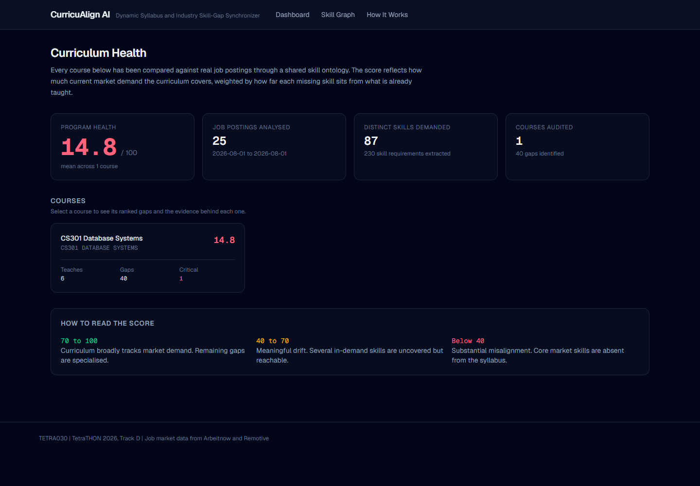
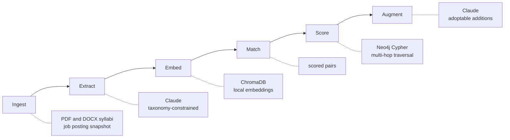

# CurricuAlign AI

**TETRA030** | TetraTHON 2026, Track D (EdTech) | Problem Statement 1: Dynamic Syllabus and Industry Skill-Gap Synchronizer

Higher education curricula lag three to five years behind market demand. Institutions have no automated way to audit a syllabus against live job market data, so graduates earn top grades while carrying severe skill gaps.

CurricuAlign AI ingests real syllabi and real job postings, maps both onto a shared skill ontology in Neo4j, quantifies the gap with evidence, and generates syllabus modifications a professor can adopt without redesigning the course.



---

## What makes this different

**Most tools tell you what is missing. This one tells you what it costs to fix.**

A keyword diff reports that a syllabus lacks Retrieval Augmented Generation. That is a complaint, not a plan. Because the ontology records which skills are prerequisites for which, this system answers the harder question:

| Hops | Prerequisite for RAG |
|---|---|
| 1 | Large Language Models, Vector Databases |
| 2 | Databases, Embeddings, Transformers |
| 3 | Data Structures, Deep Learning |
| 4 | Machine Learning, Optimization, Programming Fundamentals |

So a recommendation becomes *"you cannot teach RAG until this chain is covered, in this order"* rather than *"you are missing RAG"*. Adding Kubernetes to a course already teaching Docker is one hop and cheap; adding RAG to a course covering none of its prerequisites is a different conversation entirely.

That distinction is also the answer to **why a graph database**: it is a variable-length path search, which a relational schema answers only with a recursive query that degrades with every hop.

---

## Live gap report

Every gap cites real posting counts and its distance from what the course already teaches.


---

## Skill ontology graph

Green nodes are taught by the curriculum, amber nodes are demanded by employers but uncovered. Node size is market demand. Clicking a node returns its prerequisite chain.


---

## Architecture

Six stages, each with one responsibility and a stable interface, so any stage can be replaced without touching its neighbours.



| Stage | Input | Output | Implementation |
|---|---|---|---|
| Ingest | PDF/DOCX syllabi, job postings | Normalized `Document` | pdfplumber, python-docx |
| Extract | Raw document text | `SkillMention`, taxonomy-linked | Claude, structured output |
| Embed | Canonical skills | Vectors | sentence-transformers, ChromaDB |
| Match | Mentions and vectors | Scored `(mention, skill)` pairs | exact alias, then similarity |
| Score | Graph state | `GapReport` with severity | Cypher plus scoring module |
| Augment | GapReport and course subgraph | Syllabus modifications | Claude |

**The Match stage is a deliberate seam.** It emits nothing but scored pairs, so if vector retrieval underperforms it can be swapped for fuzzy taxonomy matching with no downstream change. `ExactMatcher` already ships as that fallback.

### The three mandated components

| Requirement | Implementation |
|---|---|
| Skill Ontology Graph (Neo4j) | 438 skills, 1474 aliases, 587 prerequisite edges |
| Semantic Gap Analyzer (ChromaDB) | All skills embedded locally, no paid embedding API |
| Syllabus Augmenter (LLM) | Claude, constrained to additions that extend existing units |

### Stack

FastAPI and Python 3.11, Next.js and TypeScript, Neo4j 5.26, ChromaDB in embedded mode, Claude API, Docker Compose. Frontend types are generated from the OpenAPI schema.

---

## Running it

```bash
cp .env.example .env          # add your ANTHROPIC_API_KEY
docker compose up -d          # Neo4j and the backend
docker compose exec backend python -m app.seed
```

Frontend:

```bash
cd frontend
npm install
npm run dev
```

- Application: `http://localhost:3000`
- API documentation: `http://localhost:8000/docs`
- Neo4j Browser: `http://localhost:7474` (neo4j / curricualign)

Try the query that justifies the graph:

```cypher
MATCH path = (p:Skill)-[:PREREQUISITE_OF*1..4]->(t:Skill {canonical_name: 'Retrieval Augmented Generation'})
RETURN path
```

Tests:

```bash
docker compose exec backend pytest tests/ -v
```

---

## Engineering decisions worth defending

**The taxonomy is a hard constraint, not a suggestion.** Skill extraction links to a curated canonical list and cannot invent nodes. Without this, `ML` and `Machine Learning` become separate skills and every downstream number is meaningless. Ambiguous aliases fail at load time rather than resolving to whichever skill loaded last; that gate rejected three real collisions during the build.

**Extraction cost is managed by the vector index.** Sending all 438 canonical names in every prompt would be roughly 1.8M tokens across the corpus. ChromaDB shortlists 60 candidates per document and Claude chooses from the shortlist, cutting prompt size by about ninety percent. That is the two mandated components working together.

**Every Claude call is cached by content hash.** Verified: with the API key blanked entirely, a previously seen posting still returned all 15 extracted skills in 0.17 seconds. An expired key during evaluation degrades to instant cached results rather than a broken page.

**Soft skills are down-weighted, not censored.** Ranking by raw posting frequency put Team Collaboration and Mentoring above every technical gap. Both are genuine market signal, but "add teamwork to your database course" is not advice a curriculum committee can act on.

---

## Bugs the tests caught

These are worth stating because each produced a plausible-looking wrong number that would have survived a demo unnoticed.

**The health score ran backwards.** Adding twenty trivial gaps to one critical gap raised the score from 5 to 73 — making a curriculum worse made it look better. A normalized weighted mean was letting a long tail dilute the average. Replaced with an unnormalized rank-decay penalty, so additional gaps can only lower the score.

**The similarity threshold accepted noise.** The floor was 0.35, guessed during planning. Measured against the real index:

| Band | Range |
|---|---|
| Genuine skill phrases | 0.643 - 0.776 |
| Unrelated syllabus prose | 0.554 - 0.619 |

At 0.35, *"the cafeteria serves lunch at noon"* matched Service Mesh at 0.565 and would have entered a gap report as a phantom skill with fabricated evidence. Recalibrated to 0.63, inside the separation gap, with `scripts/calibrate_threshold.py` reproducing the measurement.

**Neo4j raised on `shortestPath`** when a demanded skill was also a taught skill, because start and end resolved to the same node. Not an edge case: it happens for every skill the curriculum already covers, which is exactly what coverage measurement needs.

---

## Honest limitations

- **Embeddings do not encode negation.** *"Finding patterns without labelled examples"* retrieves Supervised Learning, the exact opposite of the right answer. This is why exact taxonomy resolution runs first and vector hits never override a certain alias match.
- **The job corpus spans about one month.** Free job APIs serve current listings only, so month-granularity trends work but a multi-year demand forecast does not.
- **Gap scoring weights are a first estimate**, tuned by judgment. The similarity threshold, by contrast, is measured and reproducible. Tests pin behaviour rather than constants, so the weights stay tunable.
- **Scanned PDFs without a text layer are rejected** rather than run through OCR.

---

## Repository

```
backend/app/taxonomy/    canonical skill taxonomy and alias resolver
backend/app/pipeline/    the six pipeline stages
backend/app/db/          Neo4j schema, writer, and gap queries
backend/app/api/         FastAPI endpoints
backend/tests/           129 tests
frontend/app/            four screens
scripts/                 job fetching and threshold calibration
docs/superpowers/        design specification and implementation plan
```

Job market data from [Arbeitnow](https://www.arbeitnow.com) and [Remotive](https://remotive.com).
